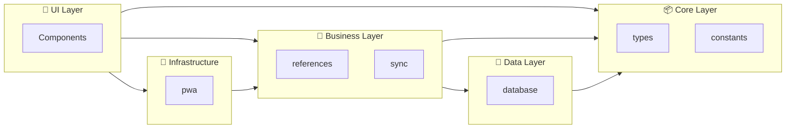
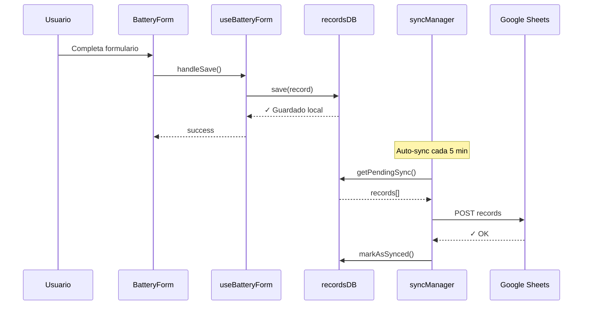

# Diagrama de Dependencias - PWA Baterías

## Vista General de Módulos

```mermaid
graph TB
    subgraph Entry["📦 Entry Point"]
        main[main.tsx]
    end

    subgraph App["🖥️ Aplicación"]
        app[App.tsx]
    end

    subgraph Components["🧩 Componentes"]
        subgraph Header["Header"]
            header[Header.tsx]
        end
        subgraph Footer["Footer"]
            footer[Footer.tsx]
        end
        subgraph Icons["Icons"]
            icons[9 SVG Icons]
        end
        subgraph Form["Form"]
            batteryForm[BatteryForm.tsx]
            inputField[InputField.tsx]
            selectField[SelectField.tsx]
            dateField[DateField.tsx]
            textAreaField[TextAreaField.tsx]
            formButtons[FormButtons.tsx]
            subgraph FormHooks["hooks/"]
                useBatteryForm[useBatteryForm.ts]
                useBatteryValidation[useBatteryValidation.ts]
            end
            subgraph FormUtils["utils/"]
                dateUtils[dateUtils.ts]
            end
            formTypes[types.ts]
        end
        subgraph RefForm["ReferenceForm"]
            referenceForm[ReferenceForm.tsx]
        end
    end

    subgraph Modules["⚙️ Módulos de Negocio"]
        subgraph Types["types/"]
            batteryTypes[battery.ts]
            storageTypes[storage.ts]
        end
        subgraph Constants["constants/"]
            inspectionOpts[inspectionOptions.ts]
            formDefaults[formDefaults.ts]
        end
        subgraph Database["database/"]
            initDB[initDB.ts]
            recordsDB[recordsDB.ts]
            referencesDB[referencesDB.ts]
            dbUtils[utils.ts]
        end
        subgraph References["references/"]
            config[config.ts]
            referencesService[references.ts]
        end
        subgraph Sync["sync/"]
            api[api.ts]
            sync[sync.ts]
            syncManager[syncManager.ts]
        end
    end

    subgraph PWA["📱 PWA"]
        swOffline[swOffline.ts]
        swCache[swCache.ts]
        subgraph PWAHooks["hooks/"]
            useOnlineStatus[useOnlineStatus.ts]
            useInstallPrompt[useInstallPrompt.ts]
            useUpdateAvailable[useUpdateAvailable.ts]
            useCacheInfo[useCacheInfo.ts]
            usePWAStatus[usePWAStatus.ts]
        end
    end

    %% Entry Point
    main --> app
    main --> swOffline

    %% App dependencies
    app --> header
    app --> footer
    app --> batteryForm
    app --> useOnlineStatus
    app --> syncManager
    app --> referencesService
    app --> referencesDB

    %% BatteryForm dependencies
    batteryForm --> inputField
    batteryForm --> selectField
    batteryForm --> dateField
    batteryForm --> textAreaField
    batteryForm --> formButtons
    batteryForm --> referenceForm
    batteryForm --> useBatteryForm
    batteryForm --> useBatteryValidation
    batteryForm --> icons
    batteryForm --> inspectionOpts

    %% Form Hooks dependencies
    useBatteryForm --> referencesService
    useBatteryForm --> formDefaults
    useBatteryForm --> batteryTypes
    useBatteryForm --> recordsDB
    useBatteryForm --> formTypes
    useBatteryForm --> dateUtils
    useBatteryValidation --> batteryTypes

    %% ReferenceForm dependencies
    referenceForm --> inputField
    referenceForm --> dbUtils
    referenceForm --> referencesService
    referenceForm --> batteryTypes

    %% Database dependencies
    recordsDB --> initDB
    recordsDB --> storageTypes
    referencesDB --> initDB
    referencesDB --> storageTypes
    dbUtils --> initDB
    dbUtils --> recordsDB

    %% References dependencies
    config --> batteryTypes
    referencesService --> config
    referencesService --> storageTypes

    %% Sync dependencies
    sync --> batteryTypes
    sync --> api
    syncManager --> recordsDB
    syncManager --> sync
    syncManager --> api

    %% PWA dependencies
    swOffline --> syncManager
    useOnlineStatus --> swOffline
    useInstallPrompt --> swOffline
    useUpdateAvailable --> swOffline
    useCacheInfo --> swCache
    usePWAStatus --> swOffline
    usePWAStatus --> useOnlineStatus
    usePWAStatus --> useInstallPrompt
    usePWAStatus --> useUpdateAvailable
```

## Dependencias por Capa

## Flujo de Datos

## Resumen de Dependencias

| Módulo | Depende de |
|--------|-----------|
| `main.tsx` | App, pwa/swOffline |
| `App.tsx` | components, pwa/hooks, modules/sync, modules/references, modules/database |
| `BatteryForm` | Form/*, Icons/*, ReferenceForm, modules/constants |
| `useBatteryForm` | modules/references, modules/constants, modules/types, modules/database, Form/types, Form/utils |
| `useBatteryValidation` | modules/types |
| `ReferenceForm` | Form/InputField, modules/database, modules/references, modules/types |
| `recordsDB` | database/initDB, modules/types |
| `referencesDB` | database/initDB, modules/types |
| `sync.ts` | modules/types, sync/api |
| `syncManager` | database/recordsDB, sync/sync, sync/api |
| `swOffline` | modules/sync |
| `PWA hooks` | pwa/swOffline, pwa/swCache |

## Módulos Independientes (Sin dependencias internas)

- `types/*` - Solo tipos/interfaces compartidos
- `constants/*` - Solo constantes de configuración
- `Icons/*` - Solo exportan SVGs
- `Form/types.ts` - Solo tipos del formulario
- `Form/utils/dateUtils.ts` - Función pura
- `sync/api.ts` - Solo configuración de API
- `database/initDB.ts` - Solo inicialización IndexedDB
