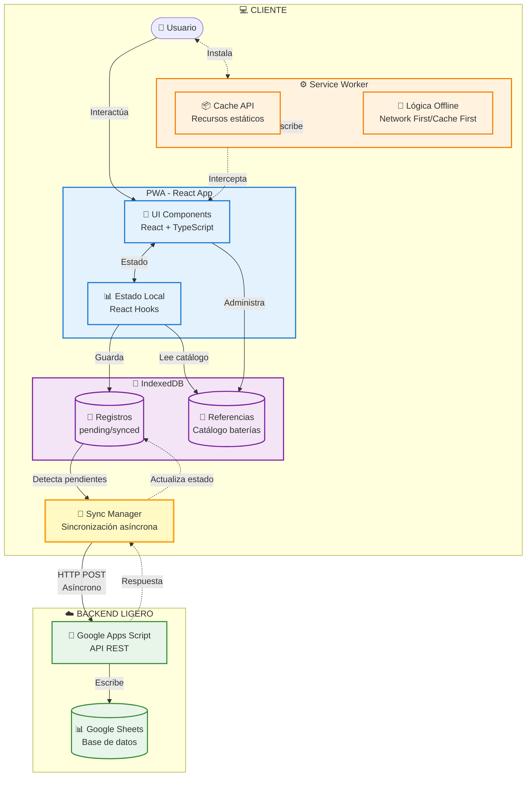
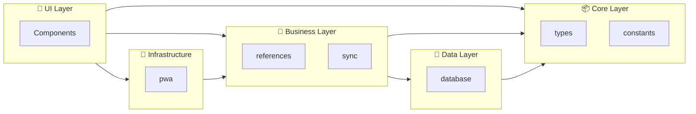
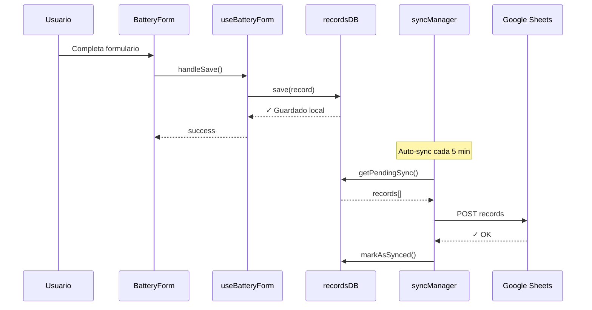

# Arquitectura - PWA Baterías

## Arquitectura General del Sistema

```mermaid
graph TB
    subgraph Client["💻 CLIENTE"]
        User([👤 Usuario])
        
        subgraph PWA["PWA - React App<br/>(Cliente-Only)"]
            UI[🎨 UI Components<br/>React + TypeScript]
            State[📊 Estado Local<br/>React Hooks]
        end
        
        subgraph ServiceWorker["⚙️ Service Worker"]
            Cache[📦 Cache API<br/>Recursos estáticos]
            OfflineLogic[🔌 Lógica Offline<br/>Network First/Cache First]
        end
        
        subgraph Storage["💾 IndexedDB"]
            Records[(📝 Registros<br/>pending/synced)]
            References[(🔋 Referencias<br/>Catálogo baterías)]
        end
        
        SyncManager[🔄 Sync Manager<br/>Sincronización asíncrona]
    end
    
    subgraph Backend["☁️ BACKEND LIGERO"]
        API[📡 Google Apps Script<br/>API REST]
        Sheets[(📊 Google Sheets<br/>Base de datos)]
    end
    
    %% Flujo principal
    User -->|Interactúa| UI
    UI <-->|Estado| State
    User <-.->|Instala| ServiceWorker
    
    %% Service Worker
    ServiceWorker -.->|Intercepta| UI
    ServiceWorker <-.->|Lee/Escribe| Cache
    
    %% Almacenamiento local
    State -->|Guarda| Records
    State -->|Lee catálogo| References
    UI -->|Administra| References
    
    %% Sincronización
    Records -->|Detecta pendientes| SyncManager
    SyncManager -->|HTTP POST<br/>Asíncrono| API
    API -->|Escribe| Sheets
    API -.->|Respuesta| SyncManager
    SyncManager -.->|Actualiza estado| Records
    
    %% Estilo
    classDef clientStyle fill:#e3f2fd,stroke:#1976d2,stroke-width:2px
    classDef workerStyle fill:#fff3e0,stroke:#f57c00,stroke-width:2px
    classDef storageStyle fill:#f3e5f5,stroke:#7b1fa2,stroke-width:2px
    classDef backendStyle fill:#e8f5e9,stroke:#388e3c,stroke-width:2px
    classDef syncStyle fill:#fff9c4,stroke:#f9a825,stroke-width:3px
    
    class PWA,UI,State clientStyle
    class ServiceWorker,Cache,OfflineLogic workerStyle
    class Storage,Records,References storageStyle
    class API,Sheets backendStyle
    class SyncManager syncStyle
```

### 📋 Características Clave de la Arquitectura

#### 🎯 **Cliente-Only (Client-Side App)**
- **Toda la lógica** reside en el navegador
- No hay servidor de aplicación tradicional
- El código se sirve estáticamente (GitHub Pages/CDN)
- React app con TypeScript funciona 100% en el cliente

#### 🪶 **Apps Script como Backend Ligero**
- Google Apps Script actúa como **API REST minimalista**
- Solo recibe datos via HTTP POST y los escribe en Google Sheets
- **Sin lógica de negocio compleja** en el backend
- Sin autenticación/autorización (puede agregarse si se requiere)

#### ⚡ **Sincronización Asíncrona**
- Los registros se guardan **primero en IndexedDB** (local)
- El usuario recibe confirmación inmediata
- **Sync Manager** ejecuta sincronización en segundo plano:
  - Detecta registros con `pendingSync: true`
  - Envía datos cuando hay conexión
  - Reintenta automáticamente en caso de fallo
  - Actualiza estado a `synced` al confirmar

#### 🔌 **Offline-First**
- **Service Worker** intercepta todas las peticiones de red
- Estrategia Cache First para recursos estáticos (HTML, CSS, JS, imágenes)
- La app funciona completamente sin internet:
  - Formularios operativos
  - Almacenamiento local
  - Validaciones
  - Catálogo de referencias
- Sincronización automática cuando se recupera conexión

---

## Vista General de Módulos

```mermaid
graph TB
    subgraph Entry["📦 Entry Point"]
        main[main.tsx]
    end

    subgraph App["🖥️ Aplicación"]
        app[App.tsx]
    end

    subgraph Components["🧩 Componentes"]
        subgraph Header["Header"]
            header[Header.tsx]
        end
        subgraph Footer["Footer"]
            footer[Footer.tsx]
        end
        subgraph Icons["Icons"]
            icons[9 SVG Icons]
        end
        subgraph Form["Form"]
            batteryForm[BatteryForm.tsx]
            inputField[InputField.tsx]
            selectField[SelectField.tsx]
            dateField[DateField.tsx]
            textAreaField[TextAreaField.tsx]
            formButtons[FormButtons.tsx]
            subgraph FormHooks["hooks/"]
                useBatteryForm[useBatteryForm.ts]
                useBatteryValidation[useBatteryValidation.ts]
            end
            subgraph FormUtils["utils/"]
                dateUtils[dateUtils.ts]
            end
            formTypes[types.ts]
        end
        subgraph RefForm["ReferenceForm"]
            referenceForm[ReferenceForm.tsx]
        end
    end

    subgraph Modules["⚙️ Módulos de Negocio"]
        subgraph Types["types/"]
            batteryTypes[battery.ts]
            storageTypes[storage.ts]
        end
        subgraph Constants["constants/"]
            inspectionOpts[inspectionOptions.ts]
            formDefaults[formDefaults.ts]
        end
        subgraph Database["database/"]
            initDB[initDB.ts]
            recordsDB[recordsDB.ts]
            referencesDB[referencesDB.ts]
            dbUtils[utils.ts]
        end
        subgraph References["references/"]
            config[config.ts]
            referencesService[references.ts]
        end
        subgraph Sync["sync/"]
            api[api.ts]
            sync[sync.ts]
            syncManager[syncManager.ts]
        end
    end

    subgraph PWA["📱 PWA"]
        swOffline[swOffline.ts]
        swCache[swCache.ts]
        subgraph PWAHooks["hooks/"]
            useOnlineStatus[useOnlineStatus.ts]
            useInstallPrompt[useInstallPrompt.ts]
            useUpdateAvailable[useUpdateAvailable.ts]
            useCacheInfo[useCacheInfo.ts]
            usePWAStatus[usePWAStatus.ts]
        end
    end

    %% Entry Point
    main --> app
    main --> swOffline

    %% App dependencies
    app --> header
    app --> footer
    app --> batteryForm
    app --> useOnlineStatus
    app --> syncManager
    app --> referencesService
    app --> referencesDB

    %% BatteryForm dependencies
    batteryForm --> inputField
    batteryForm --> selectField
    batteryForm --> dateField
    batteryForm --> textAreaField
    batteryForm --> formButtons
    batteryForm --> referenceForm
    batteryForm --> useBatteryForm
    batteryForm --> useBatteryValidation
    batteryForm --> icons
    batteryForm --> inspectionOpts

    %% Form Hooks dependencies
    useBatteryForm --> referencesService
    useBatteryForm --> formDefaults
    useBatteryForm --> batteryTypes
    useBatteryForm --> recordsDB
    useBatteryForm --> formTypes
    useBatteryForm --> dateUtils
    useBatteryValidation --> batteryTypes

    %% ReferenceForm dependencies
    referenceForm --> inputField
    referenceForm --> dbUtils
    referenceForm --> referencesService
    referenceForm --> batteryTypes

    %% Database dependencies
    recordsDB --> initDB
    recordsDB --> storageTypes
    referencesDB --> initDB
    referencesDB --> storageTypes
    dbUtils --> initDB
    dbUtils --> recordsDB

    %% References dependencies
    config --> batteryTypes
    referencesService --> config
    referencesService --> storageTypes

    %% Sync dependencies
    sync --> batteryTypes
    sync --> api
    syncManager --> recordsDB
    syncManager --> sync
    syncManager --> api

    %% PWA dependencies
    swOffline --> syncManager
    useOnlineStatus --> swOffline
    useInstallPrompt --> swOffline
    useUpdateAvailable --> swOffline
    useCacheInfo --> swCache
    usePWAStatus --> swOffline
    usePWAStatus --> useOnlineStatus
    usePWAStatus --> useInstallPrompt
    usePWAStatus --> useUpdateAvailable
```

## Dependencias por Capa

```mermaid
graph LR
    subgraph UI["🎨 UI Layer"]
        Components
    end

    subgraph Core["📦 Core Layer"]
        Types[types]
        Constants[constants]
    end

    subgraph Business["💼 Business Layer"]
        References[references]
        Sync[sync]
    end

    subgraph Data["💾 Data Layer"]
        Database[database]
    end

    subgraph Infrastructure["🔧 Infrastructure"]
        PWA[pwa]
    end

    UI --> Business
    UI --> Core
    UI --> Infrastructure
    Business --> Data
    Business --> Core
    Data --> Core
    Infrastructure --> Business
```

## Flujo de Datos

```mermaid
sequenceDiagram
    participant U as Usuario
    participant BF as BatteryForm
    participant Hook as useBatteryForm
    participant DB as recordsDB
    participant Sync as syncManager
    participant API as Google Sheets

    U->>BF: Completa formulario
    BF->>Hook: handleSave()
    Hook->>DB: save(record)
    DB-->>Hook: ✓ Guardado local
    Hook-->>BF: success
    
    Note over Sync: Auto-sync cada 5 min
    Sync->>DB: getPendingSync()
    DB-->>Sync: records[]
    Sync->>API: POST records
    API-->>Sync: ✓ OK
    Sync->>DB: markAsSynced()
```

## Resumen de Dependencias

| Módulo | Depende de |
|--------|-----------|
| `main.tsx` | App, pwa/swOffline |
| `App.tsx` | components, pwa/hooks, modules/sync, modules/references, modules/database |
| `BatteryForm` | Form/*, Icons/*, ReferenceForm, modules/constants |
| `useBatteryForm` | modules/references, modules/constants, modules/types, modules/database, Form/types, Form/utils |
| `useBatteryValidation` | modules/types |
| `ReferenceForm` | Form/InputField, modules/database, modules/references, modules/types |
| `recordsDB` | database/initDB, modules/types |
| `referencesDB` | database/initDB, modules/types |
| `sync.ts` | modules/types, sync/api |
| `syncManager` | database/recordsDB, sync/sync, sync/api |
| `swOffline` | modules/sync |
| `PWA hooks` | pwa/swOffline, pwa/swCache |

## Módulos Independientes (Sin dependencias internas)

- `types/*` - Solo tipos/interfaces compartidos
- `constants/*` - Solo constantes de configuración
- `Icons/*` - Solo exportan SVGs
- `Form/types.ts` - Solo tipos del formulario
- `Form/utils/dateUtils.ts` - Función pura
- `sync/api.ts` - Solo configuración de API
- `database/initDB.ts` - Solo inicialización IndexedDB
