# Diagrama de Dependencias - PWA Baterías

## Vista General de Módulos

## Dependencias por Capa

```mermaid
graph LR
    subgraph UI["🎨 UI Layer"]
        Components
    end

    subgraph Core["📦 Core Layer"]
        Types[types]
        Constants[constants]
    end

    subgraph Business["💼 Business Layer"]
        References[references]
        Sync[sync]
    end

    subgraph Data["💾 Data Layer"]
        Database[database]
    end

    subgraph Infrastructure["🔧 Infrastructure"]
        PWA[pwa]
    end

    UI --> Business
    UI --> Core
    UI --> Infrastructure
    Business --> Data
    Business --> Core
    Data --> Core
    Infrastructure --> Business
```

## Flujo de Datos

## Resumen de Dependencias

| Módulo | Depende de |
|--------|-----------|
| `main.tsx` | App, pwa/swOffline |
| `App.tsx` | components, pwa/hooks, modules/sync, modules/references, modules/database |
| `BatteryForm` | Form/*, Icons/*, ReferenceForm, modules/constants |
| `useBatteryForm` | modules/references, modules/constants, modules/types, modules/database, Form/types, Form/utils |
| `useBatteryValidation` | modules/types |
| `ReferenceForm` | Form/InputField, modules/database, modules/references, modules/types |
| `recordsDB` | database/initDB, modules/types |
| `referencesDB` | database/initDB, modules/types |
| `sync.ts` | modules/types, sync/api |
| `syncManager` | database/recordsDB, sync/sync, sync/api |
| `swOffline` | modules/sync |
| `PWA hooks` | pwa/swOffline, pwa/swCache |

## Módulos Independientes (Sin dependencias internas)

- `types/*` - Solo tipos/interfaces compartidos
- `constants/*` - Solo constantes de configuración
- `Icons/*` - Solo exportan SVGs
- `Form/types.ts` - Solo tipos del formulario
- `Form/utils/dateUtils.ts` - Función pura
- `sync/api.ts` - Solo configuración de API
- `database/initDB.ts` - Solo inicialización IndexedDB
